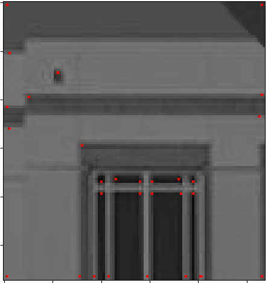

# Lecture 5 Problems

1. In terms of uniqueness and invariance, discuss why single pixels, described using their RGB values, do not make good features for image matching.
2. For each of the following (linearized) error function shapes, describe the image patch that gave rise to it:
   1. Flat in all directions
   1. Steep in one direction, flat in the orthogonal direction
   1. Steep in all directions

Let's investigate the behavior of the Harris corner detector on the three image patches shown below.
$$
\begin{bmatrix}
         2 & 2 & 2\\
         2 & 2 & 2\\
         0 & 0 & 0
       \end{bmatrix}
       \begin{bmatrix}
         0 & 2 & 2\\
         0 & 2 & 2\\
         0 & 0 & 0
       \end{bmatrix}
       \begin{bmatrix}
         2 & 2 & 2\\
         0 & 2 & 2\\
         0 & 0 & 2
       \end{bmatrix}
$$
3. Compute the structure tensor for each of the above patches. I have it on good authority that these images are noise-free, so we can safely skip the Sobel filter and compute gradients using 3x1 and 1x3 centered finite difference filters and `repeat` padding.

4. Using software of your choice (e.g., `np.linalg.eigvals`, or use the formula described [here](https://www.johndcook.com/blog/2021/05/07/trick-for-2x2-eigenvalues/)), compute the smallest eigenvalue of each of the structure tensors you computed in the prior problem.

5. Write psudeocode (or working Python code if you like, based on our lecture repository codebase) for Harris scores (i.e., smallest eigenvalue of the structure tensor for each pixel). You should make (exact or pseudocody) use of filtering and other routines that already exist in the lecture codebase.

```python
def harris_score(img):
  """ Returns the smaller eigenvalue of the structure tensor for each pixel in img.
  Pre: img is grayscale, float, [0,1]. """
```

6. Consider the following harris corner detection result, computed using the code we saw in class:
   

Some of these points would be better characterized as edge patches, rather than corner patches. Why did our code pick them up, and what would we need to change in order to get only things that really do look like corners in the image?

7. Comment on whether (or the extent to which) the Harris corner detector is robust to each of the following transformations. In other words, which of these will not affect which points will be found as corners by the Harris detector? If the detector is almost but not quite completely robust to a given change, comment on this. Assume edge effects and intensity clipping are not an issue.
   1. Intensity shift: $I(x, y)' = I(x, y) + 20$
   2. Intensity scale: $I(x, y)' = 1.2 I(x, y)$
   3. Scaling: $I(x, y)' = I(0.5x, 0.5y)$
   4. Translation $I(x, y)' = I(x - 10, y)$
   5. Rotation
