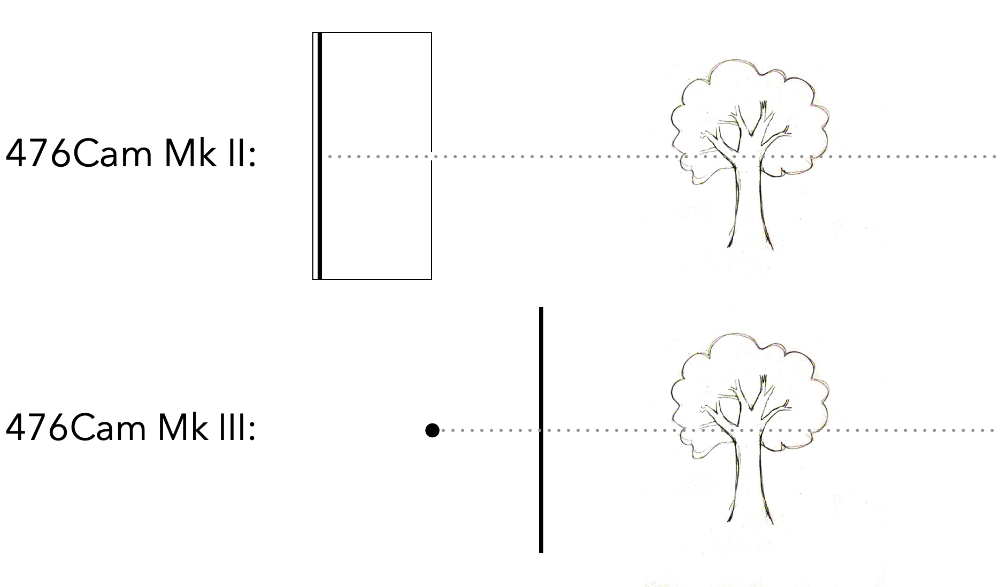
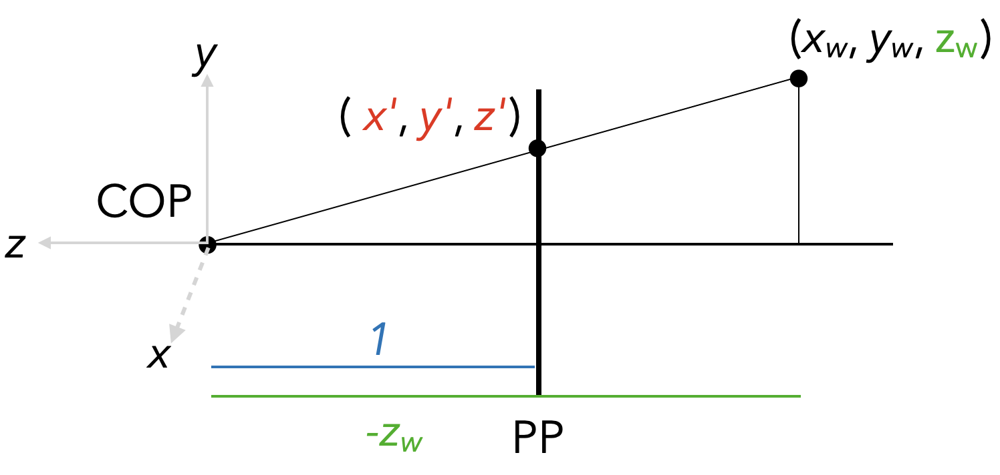
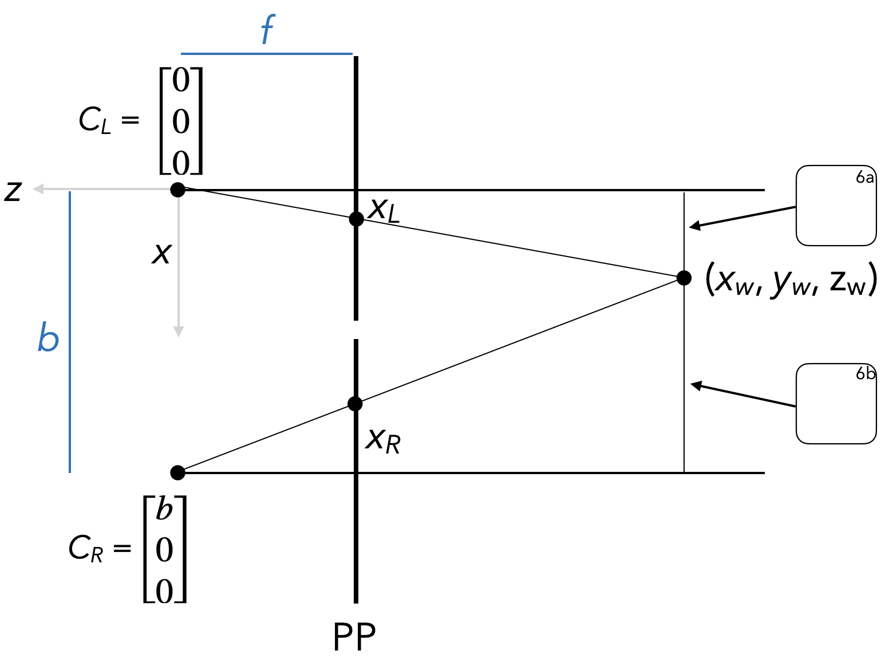

# Lecture 11 Problems

1. How does the image on the projection plane of the 476Cam Mk II differ from the image on the projection plane of 476Cam MK III? In particular, if the optical axis intersects the projection plane at $(x, y) = (0, 0)$, what are the $x$ and $y$ coordinates of a point that intersect the Mk II projection plane at $(x^{MkII}, y^{MkII})$​?

   

2. Consider the 476Cam Mk III shown below. The center of projection is at the origin, with $y$ going up, $z$ going left, and $x$ coming out of the screen towards you. The focal length (i.e., distance between the COP and the projection plane) is 1. A 3D point lies in front of the camera at world coordinates $(x_w, y_w, z_w)$; find $(x', y', z')$, the world coordinates of this point's projection onto the image plane. Assume all labeled quantities are known except for $x', y', z'$, and give your answer in terms of them.

3. Give a **matrix** that transforms a 3D point $\begin{bmatrix} x_w \\\ y_w \\ z_w \end{bmatrix}$ into a homogeneous 2D point that normalizes to $\begin{bmatrix} x' \\\ y' \\ 1\end{bmatrix}$​ (i.e., the coordinates you solved for in #2).

$$
\begin{bmatrix} \hspace{4em} & & & \\ \\ \\ \\ \\\end{bmatrix}_{3\times3}
$$

4. Now, consider a camera with a focal length $f$. Find the value of $(x', y', z')$ in this setup.

5. **Camera coordinates** live in a coordinate system that's similar (in this case) to world coordinates: $x_c$ and $y_c$ will be the same as $x'$ and $y'$ from #4, but the projection plane is a distance 1 from the COP. This means that in camera coordinates, the *normalized* position of a point gives its coordinates on the image plane ($x', y'$, as calculated above). Give a $3 \times 3$ matrix that transforms the vector $\begin{bmatrix} x_w \\\ y_w \\ z_w \end{bmatrix}$ into a point that normalizes to $\begin{bmatrix} x' \\\ y' \\ 1\end{bmatrix}$​​.

$$
\begin{bmatrix} x_c \\ y_c \\ 1 \end{bmatrix} \equiv
\begin{bmatrix}\frac{-f x_w}{z_w} \\  \frac{-f y_w}{z_w} \\ 1\end{bmatrix} \sim
\begin{bmatrix}\hspace{3em} \\ \\ \\ \\\\\end{bmatrix}_{3\times 1} =
\begin{bmatrix} \hspace{4em} & & & \\ \\ \\ \\ \\\end{bmatrix}_{3\times3}
\begin{bmatrix} x_w \\ y_w \\ z_w \end{bmatrix}
$$

6. We now have two pinhole cameras with a common focal length $f$, shared focal plane (marked PP). Notice that we're now looking *down* on these cameras, so that in the picture, $x$ goes down, $y$ comes out of the screen towards us, and $z$ goes left. The left camera center ($C_L$) is at world origin $(0, 0, 0)$, and the right camera center  ($C_R$) is a distance $b$ (for baseline) in the positive $x$ direction from the left camera center. Begin by finding the distance in the $x$ direction from the optical axis of each camera to the 3D point $(x_w, y_w, z_w)$​​, assuming $x_w$ is known. These lengths are marked on the diagram with rounded boxes labeled 6a and 6b, respectively.

   

7. Suppose that $x_L, x_R, f,$ and $b$ are known. Derive an expression for $z_w$ in terms of these quantities; note that $x_w$ is not actually known, even though we assumed it was in #6, so you'll need to make sure it cancels.
