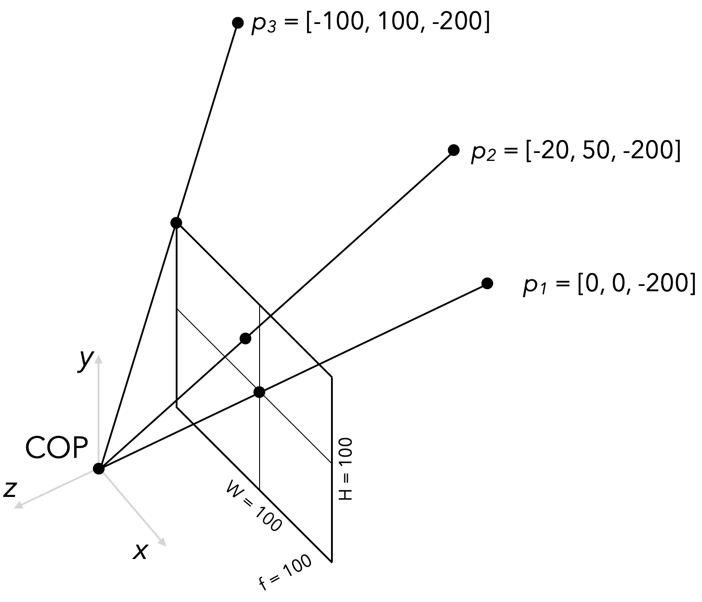
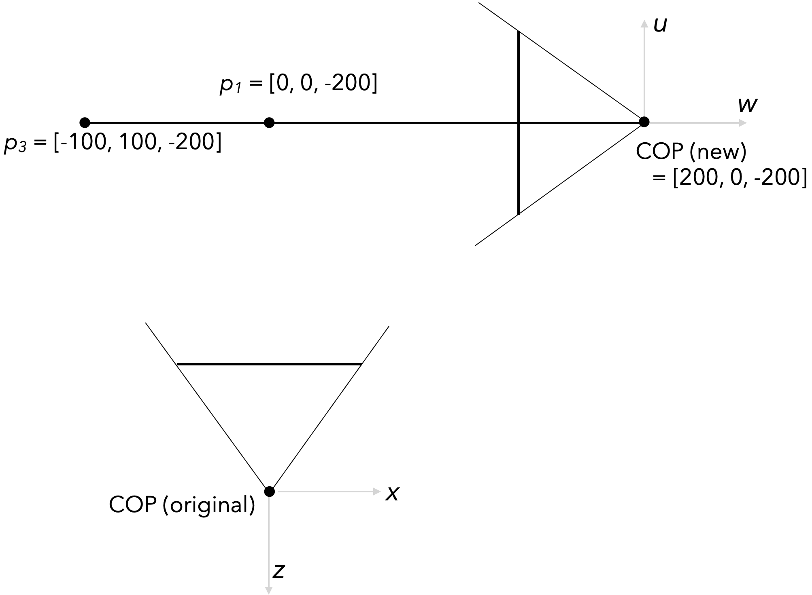

# Lecture 12 Problems - CSCI 476/576

1. Implement the normalized cross correlation cost function for two patches:

   ```python
   def ncc_cost(left_patch, right_patch):
       """ Compute the "normalized cross correlation" cost between a
       given left patch and right patch. """
   ```

   

Suppose a camera is in canonical pose - that is, COP is at world origin, the optical axis runs along the negative z axis, and the projection plane is oriented with $x$ going right and $y$ going up in image space. The focal length of the camera is 100 (this is measured in pixels), and the height and width of the image are also 100. Three world points are positioned as follows:

* $p_1 = [0, 0, -200]$
* $p_2 = [-20, 50, -200]$
* $p_3 = [-100, 100, -200]$​



2. Find the image coordinates (i.e., pixel coordinates that correspond to indices into a numpy array) of the above three world points. Keep in mind that in numpy arrays, the origin is at the top left and $y$ goes down.

3. Write down the intrinsics matrix $K$ that maps any point from camera coordinates to image coordinates as above. To check your work, make sure that applying the matrix to the three three points in the previous problem yields the expected result.

Now let's suppose we moved camera. It's now looking at the same points, but the camera center is at $[200, 0, -200]$ and it's rotated 90 degrees "left" - in terms of world coordinates, it's now facing down the negative $x$ axis, with $-z$ going right and $+y$ going up. The following diagram shows a top-down view of the world $x-z$ plane; everything relevant to this problem lives in this plane except for $p_3$​, which floats 100 units out of the screen towards you.



4. For world points $p_1$ and $p_3$ from above, give the 3D coordinates of these points in the camera's local coordinate system.

5. Give a 4x4 frame (i.e., basis plus origin) matrix that describes this camera's pose; the contents of this matrix should be
$$
\begin{bmatrix} \mathbf{u} & \mathbf{v} & \mathbf{w} & \mathbf{p}  \\ 0 & 0 & 0 & 1\end{bmatrix}
$$
where $\mathbf{u},\mathbf{v},\mathbf{w}$ are the (x, y, and z) basis vectors of the camera's local coordinate system, and $\mathbf{p}$ is its origin.

6. The above frame matrix is the "frame-to-canonical" matrix: it converts points represented in the given coordinate frame back into world coordinates. What we want instead for the camera matrix is the opposite: a matrix that transforms world coordinates into camera coordinates. Confirm (using software) that the **inverse** of the matrix that you gave in #5 correctly transforms world coordinates of Points 1 and 3 into the correct camera coordinates you found in #4.

7. Find (again, using software) the final pixel locations of world points 1 and 3.
