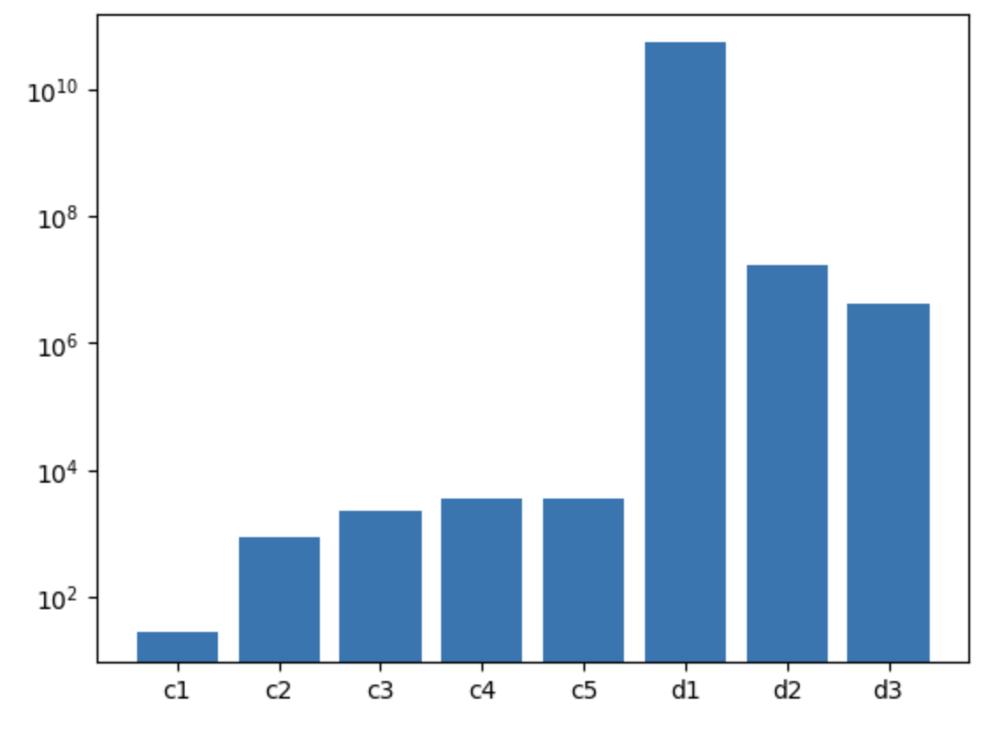

# Lecture 16 Problems - Solutions

1. Each 3x3 filter is 3 channels deep and thus has 27 parameters, plus one bias parameter for a total of 28 per filter. 8 such filters will have 8*28 = **224 parameters**.
2. A 3x3 filter with 'valid' lops one row and column off each side, so the spatial dimensions will be 225x225. Learning 8 filters means we'll have 8 output channels. So the feature map size will be **225x225x8**.
3. Scaling the image by a constant.
4. Channel mixing: making a new set of channels that are a linear combination of the old channels.
5. Output feature map sizes do not change in spatial dimension (they stay 227x227). The channel output sizes must match the input size of the next layer, and going from conv to linear requires unrolling. The input to dense1 is 227x227x256, meaning the input size needs to be the product of those. This comes out to $227*227*256 = 13,191,424$  (yikes).
6. Let's assume no bias, since that's small potatoes. The conv layers have 3x3x`input_channels` parameters. The linear layers have `input_channels` x `output_channels` parameters. So:
    * conv1: 3x3x3
    * Conv2: 3x3x96
    * Conv3: 3x3x256
    * Conv4: 3x3x384
    * Conv5: 3x3x384
    * dense1: 13191424 x 4096
    * dense2: 4096 x 4096
    * dense3: 4096 x 1000

    ```
    [27, 864, 2304, 3456, 3456, 54,032,072,704, 16,777,216, 4,096,000]
    ```

    Total: 54,052,956,027 $\approx$ 54 billion
7. dense1 dominates - note the log y scale:
