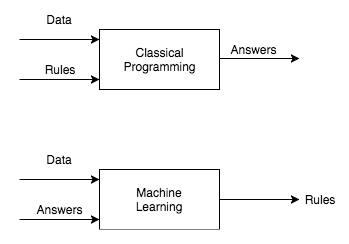

## ML0: Linear Models and Loss Functions

**Goals**:

* Be able to formulate a univariate linear regression problem and calculate the mean squared error (MSE) cost function.
* Be able to formulate a univariate logistic regression (classification) problem and calculate the logistic loss cost function.
* Know the meaning of some terminology:
  * Regression, (binary) classification, lost/cost function, weight, bias, mean squared error, log/logistic/binary cross-entropy loss

### Introduction: Once upon a time...

Early in the course, we talked about a continuum of computer vision problems, ranging from low-level (closer to the pixels) to high-level (closer to the semantic meaning of the pixels).

Once upon a time, it was thought that the low-level tools would be the building blocks for solutions to the high-level problems.

This did not pan out.

---

Instead, it has become clear that we still (and may never) do not have the tools to engineer systems that can recognize cats in a bottom-up fashion, or from first principles.

An alternative approach began to look promising as the internet came into its own, and in particular as the digital photography revolution caused the capturing and sharing of photos (and later videos) to go from expensive to practically free.

We don't know how to write down what a cat looks like, but we sure do have a lot of example cats. If we have enough examples, can we convince a computer to "learn" to detect cats?

This panned out.

The basic idea is this:

Given example inputs and ouptuts, we're going to "learn the program" from the data, or in more common terminology, we'll "fit a model" to the data.

We're going to start with what will seem like very simple toy problems and toy examples; we will run with them for a while and develop quite a bit of machinery and a little bit of theory. We'll see how to generalize these things to what we would think of as "real" computer vision problems soon enough.

### Linear Regression

Suppose we have one observable variable $x$, from which we'd like to predict some other variable $y$.

> Later we'll have *many* observable variables - namely, every single pixel of an image - and a variety of things we might want to predict about it.

As a running example, you could imagine $x$ is a number of square feet in a house, and $y$ is the market value of that house.

#### Models for Linear Regression

Simplest possible models:

* $y = c$
* $y = ax$
* $y = wx + b$ 
  * **This is where it's at.**

If $x$ and $y$ are linearly related, this last one will do the trick.

Terminology:
* $w$ is the slope, or *weight*
* $b$ is the intercept, or *bias*

#### Loss Functions for Linear Regression

How good is a candidate line? We need to measure it. We do this with a **loss function**, sometimes also called a **cost function**. Here are some ideas:

* How many points it hits: $\mathbb{1}(\hat{y}_i = wx_i + b)$
  * Real data is noisy, so we'll rarely hit more than a few points exactly.

* Mean absolute distance from points to line: $$\text{MAE} = \frac{1}{n}\sum_{i=1}^{n}|y_i - \hat{y}_i|$$
  * Intuitive; less mathematically convenient than...

* Mean squared distance from points to line: $$\text{MSE} = \frac{1}{n}\sum_{i=1}^{n}(y_i - \hat{y}_i)^2$$
  * **This is where it's at.**

Let's visualize this:

* Vibe coded demo: <https://claude.ai/public/artifacts/ab29d67b-e3d5-4be3-9ca8-0c0cb5a0b25e>

* Polished blog post: <https://mlu-explain.github.io/linear-regression/#mse-container>

**Thought Exercise** / homework problem:

6. Play with [this visualization](https://mlu-explain.github.io/linear-regression/#mse-container), and watch the total mean squared error loss. Do you think that, for any set of datapoints, there can be multiple "best" lines? In other words, there could be more than one line that achieves the minimum possible MSE?

### Linear Classifiers

Suppose now that instead of $y$ being a number (e.g., market value), it's one of a discrete set of choices. To keep things simple, we'll consider the case of 2 choices.

As a running example, imagine $x$ is the temperature and $y$ is whether there's currently snow on the ground. This is a **binary classification** problem, since the output variable is one of two values.

Terminology (applies to the regression case too):

* $x$ is our **feature** (later when there are multiple variables, it'll become our feature *vector*)
* $y$ is our **label**. Its value indicates a prediction of one of two **classes**; in our case, we will decide:
  * $y=1$ indicates "snow" 
  * $y = 0$ indicates "no snow"

#### Models for Linear Classification

The simplest model that comes to mind is a temperature threshold:

$$
y = \begin{cases}
1 & \text{if } t < t^* \\
0 & \text{otherwise}
\end{cases}
$$

This is a viable road to go down (it ends at decision trees and more generally random forests; these are practically useful models).

However, for the sake of developing reusable machinery, we'll make a different choice; I'll currently motivate it using the notion that we should make classification work like regression as much as possible.

Rather than a binary prediction, we will add a step of indirection:

* First predict the *probabaility* that $y = 1$ given a certain value of $x$.
* Then, if that probability exceeds some threshold, predict 1; otherwise predict 0.

This has the advantage of **smoothness** in the thing we're actually predicting, as well as the ability to use a modified version of the $wx + b$ model for classification as well as regression. Here's how:
$$
P(y=1 | x) = \hat{p} = \sigma(wx + b)
$$
where $\sigma(z) = \frac{1}{1 + e^{-z}}$. Huh?

Helpful visuals: <https://mlpocket.com/ml/supervised/logistic-regression>

(scroll to **The Logistic Sigmoid function** heading)

#### Loss Functions for Linear Classification

As before, the most natural idea might be to use the number of points classified correctly. This ends up having similar problems as in regression when trying to fit the model.

Instead, we'll use another loss that's theoretically well-motivated:
$$
\text{BCE} = -\frac{1}{n}\sum_{i=1}^{n}[y_i \log(\hat{p}_i) + (1-y_i)\log(1-\hat{p}_i)]
$$
oof, what's happening here?

It's an average over the dataset of a per-point **log loss** (also called **logistic loss** or **binary cross-entropy loss**). The per-datapoint calculation is:
$$
\mathcal{L}_i = -[y_i \log(\hat{p}_i) + (1-y_i)\log(1-\hat{p}_i)]
$$
There are two "modes" that this operates in, depending on the "true label" $y_i$:

* If $y_i = 1$ (there is snow), then the first term is active and the second is multiplied by $1-y_i = 0$, and the whole thing reduces to $\log(\hat{p}_i)$.

  * If our prediction $\hat{p}_i = 1$, we're perfectly correct, and the loss is $\log(1) = 0$. Being perfectly correct costs us 0.
  * If our prediction is less than 1, then the negative log gets very negative, so our loss goes up; as it approaches zero, the negative log gets very big very quickly:

  

* If the true label is $0$, then only the second term ($\log(1-\hat{p}_i)$) is active, and the opposite happens. Here's a visualization of both at the same time: <https://mlu-explain.github.io/logistic-regression/#loss-chart>

Here's a visualization of how this gets put together, and how $w$ and $b$ affect the classification: <https://mlu-explain.github.io/logistic-regression/#scatter-chart>

**Thought Exercise** / homework problem:

7. Play with this [vibe coded visualization](https://claude.ai/public/artifacts/f1b78fca-f676-4287-91e8-02f467b5b537), and watch the average logistic loss. Do you think that, for any set of datapoints, there can be multiple "best" choices of $w$ and $b$? In other words, there could be more than one sigmoid curve that achieves the minimum possible logistic loss?
